<h1 align="center">A Prison for Your Mind</h1>

<p align="center">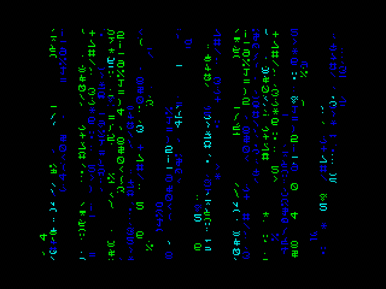</p>

<p align="center">A 16 byte intro for the ZX Spectrum released at Lovebyte 2025.</p>

<p align="center">
• <a href="https://darkside.no/zx/darklite-a_prison_for_your_mind.zip">Release</a>
• <a href="https://youtu.be/9MSvLqiJDeE">Video</a>
• <a href="https://github.com/neonz80/Writeups/tree/main/a_prison_for_your_mind/src/">Source</a>
•</p>

## Introduction

This writeup show step by step how to go from some loops that fill the
screen with characters to the final 32 byte intro. The progression is
probably not the same but the end result is exactly the same. Some
detours and experimentation along the way have been omitted.

It is probably useful to have some experience in Z80 assembly to
follow this, or at least some general assembly programming
knowledge. I've included brief explanations of ZX Spectrum specific
details about the ROM and the video memory.

## Initial experimentation

After coding two other Lovebyte intros which both featured text, I
started experimenting with different ways to copy font data from ROM
to the screen.

<p align="center"></p>

When seeing this I figured that a Matrix-like digital rain effect
could be possible in 32 bytes.

## Filling the screen with characters

### The ZX Spectrum ROM font

The font is located at address 0x3d00 in the ROM and contains 96
characters, starting with space. Each character is 8 bytes (8x8 bits).

The first 40 bytes of the font looks like this:

```diff
         0x00 0x00 0x00 0x00 0x00 0x00 0x00 0x00 space
         0x00 0x10 0x10 0x10 0x10 0x00 0x10 0x00 !
         0x00 0x24 0x24 0x00 0x00 0x00 0x00 0x00 " 
         0x00 0x24 0x7e 0x24 0x24 0x7e 0x24 0x00 #
         0x00 0x08 0x3e 0x28 0x3e 0x0a 0x3e 0x08 $
```

The same 40 bytes as 1 bit per pixel bitmap:

<p align="center"></p>

### Video memory

The video memory is located from 0x4000 to 0x5bff, where the first 6k
contains the pixels and the last 768 bytes contains the attributes
(foreground and background color). The resolution is 256x192 pixels.

The layout of the screen may seen a bit non-intuitive at first. It can
be viewed as a grid of 32x24 cells, with 8x8 pixels and one attribute
per cell. The pixels for the top 32x8 cells starts at address 0x4000,
the middle 32x8 cells starts at 0x4800 and the bottom at 0x5000. The
low byte in the address selects the cell (within the 32x8 group) and
the high byte selects the row (from 0 to 7).

The address for first line of the top left cell is 0x4000, the address
for the second line is 0x4100. The last line has the address
0x4700. The cell to the right starts at address 0x4001 and so on. The
bottom right cell on the screen starts at 0x50ff and ends at 0x57ff.

### Copying the font data

The following code copies the pixels from the first 32 characters in
the font to the screen.

```diff
         ORG 0x8000

         xor     a
         out     (0xfe), a

         ld      de, 0x3d00
         ld      l, e
 main_loop:

 column_loop:
         ld      h, 0x57

 pixel_loop:
         ld      a, (de)
         inc     e
         ld      (hl), a
         dec     h
         bit     6, h
         jr      nz, pixel_loop
        
         inc     l
         jr      nz, column_loop
        
         jr      main_loop
```

`ORG 0x8000` sets the address of the program, and the first two
instructions sets the border color to black.

The `de` register is set to point to start of the font data in the
ROM. 

The `hl` register points to the screen. The low byte is set to zero.
At the start of the column_loop, the high byte of `hl` is set to 0x57
so that it points to the bottom line of the characters in the bottom
third of the screen.

The pixel loop reads one byte from the font and writes this byte to
the screen. The font pointer is incremented, but note that it uses
`inc e`. This means that the pointer will wrap around after 256
iterations and only the pixels for the first 32 characters will be
read.

The high byte of the screen pointer is decremented and if bit 6 is set
it will loop back to the start of the pixel loop.

The pixel loop will therefore run 24 times and write to one cell in
the bottom third, one cell in the middle third and one cell in the top
third of the screen. When `h` changes from 0x40 to 0x3f the loop will
terminate.

After the pixel_loop has finished, `l` is incremented and the code
will jump back to the start of the column_loop as long as `l` is
not 0. The column_loop will run 256 times and the end result is that
all 768 cells are written to. 

Here is a slowed-down version of how this looks:

<p align="center">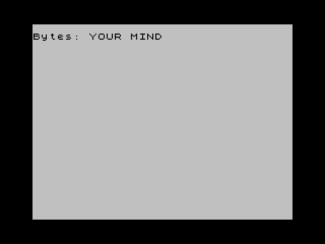</p>

At the end the screen looks like this:

<p align="center">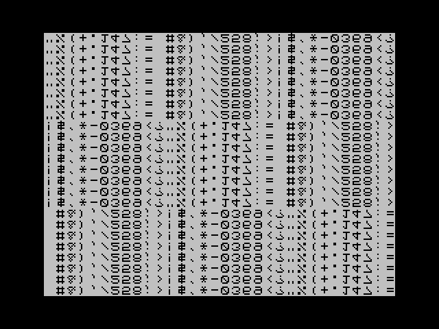</p>

The characters are upside down the code is drawing each cell from the
bottom but the font pointer is incremented. For this intro this works
fine and gives the text a bit more alien look.

## Adding animation

So far the screen is static even though the code runs forever. For
each cell on the screen font pointer will be the same. Simple
animation can be added by an `inc e` instruction before the last
jump.

```diff
         jr      nz, column_loop

+        inc     e
         jr      main_loop
```

<p align="center">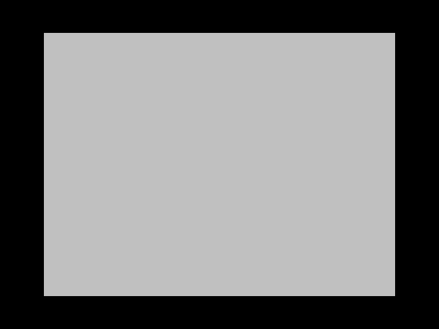</p>

The effect of the `inc e` instruction is that each time a cell is
drawn, the font pointer will be one byte further into the font
data. Each cell is now a tiny little window into the font.

Since there are 32 cells in a line and 8 bytes per cell, all cells in
the same column within the same 32x8 group will show the same pixels
since the font pointer will be the same for these. 

This will change when color is added, but for now here is how it looks
with 3 `inc e` instructions added at the top of the column loop:

<p align="center"></p>

Adding 1 or 2 instead of 3 looks fine as well. Adding 5, 6 and 7 is
basically the same as adding 3, 2 and 1, and adding 4 doesn't look as
good as the others.

## Adding color

To add color, the attribute memory needs to be written. As mentioned
earlier, the attribute memory starts at address 0x5800, right after
the pixels, and is 768 bytes. A quick test is just to add 3 to the
pointer to the video memory, so lets see what that looks like.

```diff
         ...
 column_loop:
-        ld      h, 0x57
+        ld      h, 0x5a

 pixel_loop:
         ...
```

<p align="center">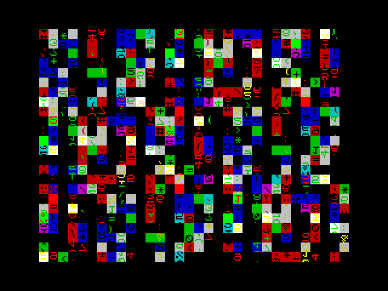</p>


This works, but looks like a mess. It is obvious that the colors must
be handled in a different way.

### Attributes

Each attribute byte defines the colors in a cell. The layout of the
bits in this byte is `NHgrbGRB`, where `GRB` is the green, red and
blue component for the foreground color and `grb` is the same for the
background color. `H` is the highlight and makes both colors brighter,
and `N` enables blinking. 

Below are some examples of different attribute values:

<p align="center">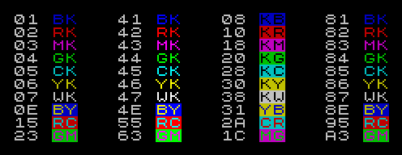</p>

For this intro a black background color works best, so these bits
should always be zero. Blinking should also be disabled. For this, a
separate attribute loop which sets these bits to zero is needed:


```diff
         ORG 0x8000

         xor     a
         out     (0xfe), a

         ld      de, 0x3d00
         ld      l, e
 main_loop:

 column_loop:
         ld      h, 0x5a

+attrib_loop:
+        ld      a, (de)
+        inc     e
+        and     0x47
+        ld      (hl), a
+        dec     h
+        bit     3, h
+        jr      nz, attrib_loop

 pixel_loop:
         ld      a, (de)
         inc     e
         ld      (hl), a
         dec     h
         bit     6, h
         jr      nz, pixel_loop
        
         inc     l
         jr      nz, column_loop

         inc     e
         jr      main_loop
```

The new attrib loop will clear the background color and the blink bits
by anding with 0x47. The loop will run until bit 3 in `h` is 0, which
is when h reaches 0x57. The loop will run 3 times.

<p align="center">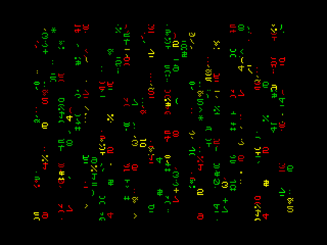</p>

This looks a bit better, but there are only 3 colors. The reason for
this is that none of the characters in the font have the low bit set,
so the blue componente is always 0. This can be fixed by shifting the
value to the right.

```diff
         ...
 attrib_loop:
         ld      a, (de)
         inc     e
+        rra
         and     0x47
         ld      (hl), a
         dec     h
         bit     3, h
         jr      nz, attrib_loop
         ...
```

<p align="center">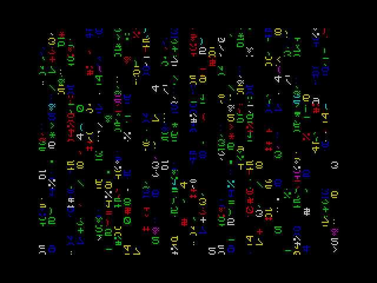</p>

The `rra` instruction does the trick and now all 7 colors are
shown. `rrca` could have been used as well since the top bit will be
masked out anyway. Shifting with `srl a` is on the other hand a bad
idea since this instruction uses 2 bytes while `rra` and `rrca` only
use 1.

### Better colors

These RGB colors do not really fit the matrix theme. This can be changed
by adjusting the mask to clear bit 1 as well, removing the red component.

```diff
         ...
 attrib_loop:
         ld      a, (de)
         inc     e
         rra
-        and     0x47
+        and     0x45
         ld      (hl), a
         dec     h
         bit     3, h
         jr      nz, attrib_loop
         ...
```

<p align="center">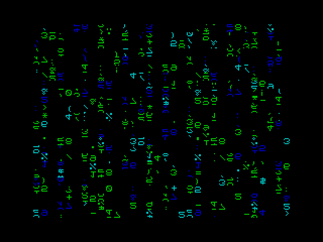</p>


### Vertical stripes

To get a more matrix-like effect, the colors should have some kind of
vertical stripe-like pattern. Let's see what happens if `l` is
combined with the font data.

```diff
         ...
 attrib_loop:
         ld      a, (de)
         inc     e
+        sub     l
         rra
         and     0x45
         ld      (hl), a
         dec     h
         bit     3, h
         jr      nz, attrib_loop
         ...
```

<p align="center">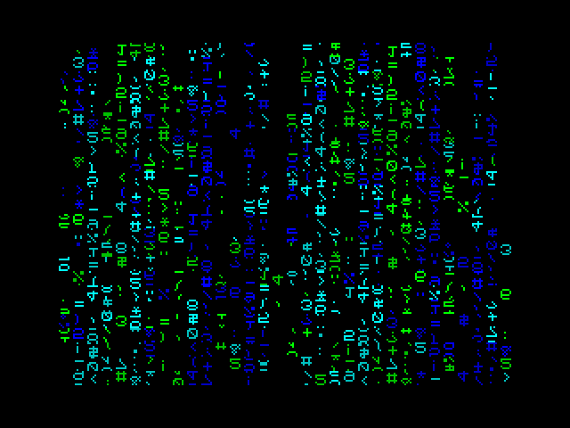</p>

Now there is a hint of vertical stripes going on. The reason this
works is because `l` is the low byte of the attribute address, so for
a given attribute it will always have the same value.  More
specifically, the lower 5 bits is the column number so these bits will
be the same for all attributes in a column. Since the `sub l`
instruction is executed before the `rra` instruction, the middle 3
bits of the column number is mostly what determines the stripes and is
why the column pattern repeats twice. Both `add l` and `xor l` can be
used instead for similar results.

It is now an option to remove the `rra` instruction, since the low bit
is no longer always zero. This will use the lowest 3 bits of the
column number instead of the middle 3 bits and the result is a pattern
that repeats 4 times and does not look as good.

### Moving stripes

The final piece of the puzzle is to make the vertical stripes a bit
more dynamic. For each cell, the `e` register will increment by one
for each frame, so let's use that one. 

```diff
         ...
 attrib_loop:
         ld      a, (de)
         inc     e
         sub     l
+        and     e
         rra
         and     0x45
         ld      (hl), a
         dec     h
         bit     3, h
         jr      nz, attrib_loop
         ...
```

<p align="center">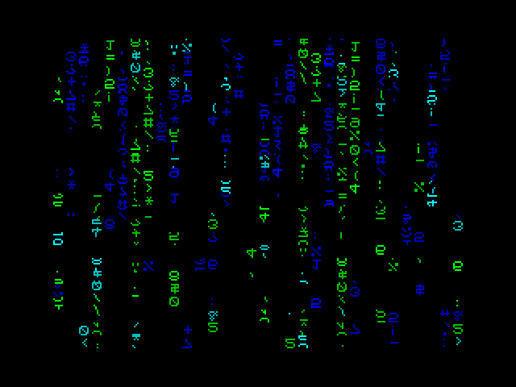</p>

Now there is some more movement going on. `and` was chosen since this
will turn more attributes to black and makes the movement look better.

## Saving bytes

The full code now looks like this:

```diff
         ORG 0x8000

         xor     a
         out     (0xfe), a

         ld      de, 0x3d00
         ld      l, e
 main_loop:

 column_loop:
         ld      h, 0x5a

 attrib_loop:
         ld      a, (de)
         inc     e
         sub     l
         and     e
         rra
         and     0x45
         ld      (hl), a
         dec     h
         bit     3, h
         jr      nz, attrib_loop

 pixel_loop:
         ld      a, (de)
         inc     e
         ld      (hl), a
         dec     h
         bit     6, h
         jr      nz, pixel_loop
        
         inc     l
         jr      nz, column_loop

         inc     e
         jr      main_loop
```

This is the same as the final version except for size
optimizations. The current size is 36 bytes, 4 bytes too large.

The first 2 bytes can be saved with the realization that the initial
values of `e` and `l` do not matter. The value of `e` is just the
start position in the font, and since it is incremented by one for each
iteration of the main_loop, we can just leave it to whatever it was at
startup. The same is true for `l`. Any non-null value means that
the first frame will not fill the entire screen.

```diff
         ...
-        ld      de, 0x3d00
-        ld      l, e
+        ld      d, 0x3d
 main_loop:
         ...
```

It is possible to take advantage of the initial register values at
startup. When the program is started from BASIC with the `USR`
function, `bc` will contain the entry point address and `a` the same
value as `c`. In this case, the entry point is 0x8000 so `b` is 0x80
and `c` and `a` is 0x00.

Since `a` already is zero, the first `xor` instruction which clears
`a` can be removed, saving one byte.

```diff
         ORG 0x8000

-        xor     a
         out     (0xfe), a
         ...
```

To get rid of the final byte, a trick common when sizecoding on the ZX
Spectrum is used. We are free to choose the start address of the
program, so the initial value of `bc` and `a` can be almost anything
we want. The setting of the border already assumes the low byte of the
address is 0x00, but the high byte can be changed. The initial value
of `b` can then be used instead of one of the constants.

Unfortunately, none of the constants used (0x3d, 0x5a and 0x45) are
suitable. 0x3d00 is in the ROM and 0x5a00 and 0x4500 are both in the
video memory. However, by swapping the `rra` instruction and the last
`and` instruction, the mask will be applied before the rotation. The
new mask has to be 0x45*2, or 0x8a, and 0x8a00 is a valid start
address. Instead of an immediate value, `b` can now be used as a mask
instead, which is 1 byte smaller.

The final 32 byte version looks like this:

```diff
-        ORG 0x8000
+        ORG 0x8a00

         out     (0xfe), a

         ld      d, 0x3d
 main_loop:

 column_loop:
         ld      h, 0x5a

 attrib_loop:
         ld      a, (de)
         inc     e
         sub     l
         and     e
-        rra
-        and     0x45
+        and     b
+        rra
         ld      (hl), a
         dec     h
         bit     3, h
         jr      nz, attrib_loop

 pixel_loop:
         ld      a, (de)
         inc     e
         ld      (hl), a
         dec     h
         bit     6, h
         jr      nz, pixel_loop
        
         inc     l
         jr      nz, column_loop

         inc     e
         jr      main_loop
```

## Final words

In the end the intro turned out quite fine, but it's not really the
same as the original matrix effect. There were two other intros
released at Lovebyte with a more faithful rendition of the effect,
[Matrix 64](https://demozoo.org/productions/367693/) for the ZX
Spectrum by Busy and
[Matrixh](https://demozoo.org/productions/367739/) for MS-DOS by
Xeleh.
