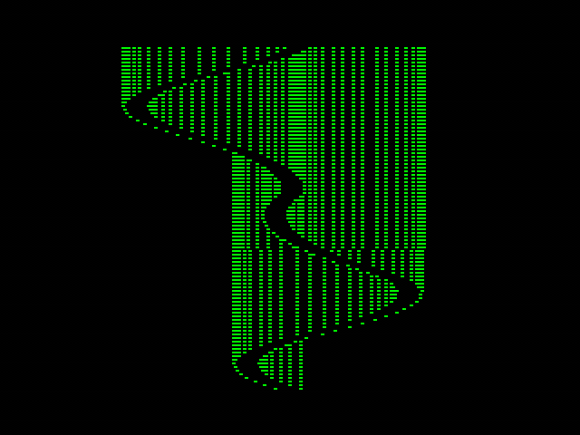
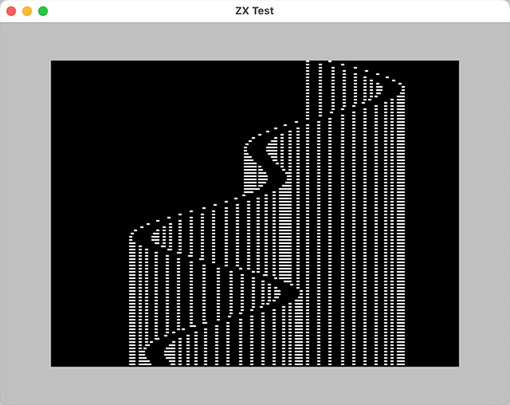

<h1 align="center">Aurora Borealis</h1>

<p align="center"></p>

<p align="center">A 128 byte intro for the ZX Spectrum released at Lovebyte 2025.</p>

<p align="center">
• <a href="https://darkside.no/zx/darklite-aurora_borealis.zip">Release</a>
• <a href="https://youtu.be/U3U-4r7qRS0">Video</a>
• <a href="https://github.com/neonz80/Writeups/tree/main/aurora_borealis/src/">Source</a>
•</p>

## Introduction

The effect in this intro is called [vertical
rasterbars](https://en.wikipedia.org/wiki/Raster_bar#Vertical_raster_bars),
also knowns as [Alcatraz bars](https://youtu.be/o88HjHs0eJQ?t=930) and
[Kefrens bars](https://youtu.be/HxUoZqv948k?t=2612).

This effect is surprisingly simple and is achieved by display the same
line of video memory over and over again and updating this line for
each scanline. 

Unfortunately there is no video hardware in the ZX Spectrum that can
help with this effect, so everything has to be done in software. Since
the screen is 1 bit per pixel, the code that updates the buffer has to
combine the previous values and the new bitmap using a mask.

## Prototyping 

I started by putting together a quick prototype to see how this was
going to look. For this I used a small framework written in C++ which
makes it easy to create ZX-like effects with the same graphical
constraints as the real machine.

<p align="center"></p>

After some testing it turned out that a fairly simple 16 pixel wide
bitmap looked best. 

<p align="center"></p>

At this stage the bars were not flipped upside down yet. This was done
later as a size optimization(!)

## Overview

For each line the bar bitmap must be added to the buffer and as
mentioned earlier this must be done using masks. 

For example, to add a 16 pixel bitmap at position 3 in a 24 pixel
wide buffer, this is what it looks like:

```
buffer                  11111100 00000000 00111011
mask                    11100000 00000000 00011111 
bitmap                     11000 00000000 011
buffer & mask           11100000 00000000 00011011
buffer & mask | bitmap  11111000 00000000 01111011
```

The buffer and mask are combined with a bitwise and. The result is
combined with the bitmap a with bitwise or. With a 16 pixel wide
bitmap and mask, only 3 bytes in the buffer need to be changed
regardless of the buffer size.

The fastest and probably smallest way to do this was to pre-shift the
mask and the bitmap at startup. 

## The code

### Setup

```
         ORG 0x8000

BUFFER = 0xb8e0
SINE = (BUFFER & 255) << 8
```

The start address of the intro is 0x8000. The address must be 256 byte
aligned otherwise it can be almost anywhere.

`BUFFER` is the address of the 256 pixel (32 byte) line buffer. This
buffer must be located at offset 0xe0 in a 256 byte page. The high
byte of the address is used as x offset for the bars and 0xb8 makes
them centered.

`SINE` is the address of the sine table. In the code the high byte of
this address is also used as the low byte of the line buffer, so it
must be 0xe000.

### Preparing the bitmap

```
 start:
 bitmap: 
         ; mask
         db      0b00000000
         db      0b11111111
         ; padding
         db      0
         ; bitmap
         db      0b11000000
         db      0b00000011
         db      0
```

The start of the program contains the bitmap mask and the bitmap
pixels. The middle mask byte is omitted since it will always be
0xff. The padding is needed to avoid shifting 1's into the first
bitmap byte.

These bytes are also exectued at the start, and the instructions are
`nop`, `rst 0x38`, `nop`, `ret nz` and `inc bc`. `rst 0x38` is the
interrupt handler and calling this is safe, and `ret nz` will not be
taken since the zero flag is set when the program starts. The `inc bc`
is a problem but `bc` will be adjusted below.

---

```
         dec     bc
         push    bc
         pop     hl
```

This sets `hl` to the address of the bitmap mask/pixels. At the start
of the program `bc` points to the entrypoint, so `inc bc` is needed
because of the `dec bc` in the bitmap. 

This uses 3 bytes, the same as `ld hl, bitmap`, but `c` must be zero
later in the code so this will save one byte.

---

```
 shift_loop:
         scf
 shift_inner_loop:
         ld      a, (hl)
         inc     h
         rra
         ld      (hl), a
         dec     h
         inc     l
         jr      nz, shift_inner_loop
         inc     h
         jr      nz, shift_loop
```

This code creates 7 copies of the bitmap mask/pixels, shifted 1-7 bits
to the right. The unshifted copy is located at address 0x8000 and the
shifted ones are written to address 0x8100, 0x8200 and so on. The
`scf` instruction makes sure 1 is shifted into the first mask byte.

The first time around, the inner loop will read from 0x8000-0x80ff and
write the shifted bytes to 0x8100-0x81ff. The next time it will read
from 0x8100-0x81ff and write to 0x8200-0x82ff and so one. Shifting the
entire 256 byte page saves some bytes since `l` can be used as the
loop counter and doesn't have to be reset for each iteration of
`shift_loop`.

The outer loop, `shift_loop`, will not stop at 8 iterations but run
until `h` wraps around from 0xff to 0x00, filling the entire memory
from 0x8100 upwards. The last iteration writes to the ROM, but this is
fine.

The shifted masks and bitmap now looks like this:

<p align="center"></p>

These are the first 6 bytes in each page, going from 0x8000 to
0x8700. Magenta is the mask and green is the bitmap.


### Generating the sine table

This code is a variant of the sine generator by Baze which can be found
[here](https://github.com/neonz80/sine/blob/main/sine_baze.asm).

```
         ld      d, high SINE
 sine_loop:
         ld      e, c
         rrc     e
         sbc     a
         ld      b, a
         xor     h
         ld      (de), a
         add     hl, bc
         dec     c
         jr      nz, sine_loop
```

The difference from the original version is that this one generates
values from -32 to 31 by removing one of the `add hl, bc` instructions
in the original code.

The sine table is written to address 0xe000 to 0xe0ff.

### Clearing the screen

The ROM is used to clear the screen.

```
         ld      (iy+83), 0x44
         call    0x0daf

         out     (0xfe), a
```

The current attribute value is set to bright green on black (0x44)
before the ROM clear screen function at 0x0daf. After this call, `a`
is zero. This value is written to the ULA port to set the border to
black.

### The main loop

The main loop runs forever and `e` is used as frame counter. The
inital value does not matter so it is not initialized.

#### Clearing the buffer

At the start of the main loop the 32 byte buffer is cleared.

```
 main_loop:
         ld      hl, BUFFER

 clear_loop:
         ld      (hl), 0
         inc     l
         jr      nz, clear_loop
```

Since the buffer is located at 0xb8e0 it will terminate after 32
iterations when `l` reaches zero.

#### Drawing 

The draw loop runs 95 times and draws every other line from 190 to
line 2.  `d` is the loop counter (screen y/2).

```
         ld      d, 95
 draw_loop:
         push    de
```

The loop counter is initialized and the loop starts. `de` is saved
since it will be modified in each iteration.

---

For each line, the current x position needs to be calculated. The
formula used is $`x = sin(7y-2F)+sin(4y+F)+y`$, where $`F`$ is the
frame counter. This gives the curve a nice wavy look with a slight
tilt from the top left to the bottom right. The sine values are signed
so the position needs to be adjusted to make the curve centered.

Keep in mind that `d` is y and `e` is the frame counter. 


```
         ld      h, high SINE
         ld      a, d
         add     a
         push    af
```

`h` is set to point to the sine table and then $`2y`$ is calculated and
the result is saved for later use.

---

```
         add    a
         add    e
         ld     l, a
         ld     c, (hl)
```

Then $`4y+F`$ is calculated and c is set to $`sin(4y+F)`$.

---

```
         sub     e
         sub     e
         add     a
         sub     d
```

$`7y-2F`$ is calculated from $`4y+F`$ by subtracting the frame
counter twice, doubling the result and then subtracting y.

---

```
         ld      l, a
         ld      a, (hl)
         add     c
         add     d
```

`a` is set to $`sin(7y-2F)+sin(4y+2F)+y`$ which is the unadjusted x
position.

---

```
         ld      d, high BUFFER
         sub     d
         ld      c, a					
```

The x position is adjusted to make the curve centered by subtracting
the high address of the buffer, or 0xb8. This is the same as
adding 72. The result is stored in `c` as well for later use.

---

Now we need to calculate the buffer address of where to plot the
bitmap and which of the 8 shifted bitmaps to use.

The low byte of the buffer address is $`0xe0+x/8`$ and the high byte
of the bitmap address is $`0x80+(x\&7)`$.

```
         rrca						
         rrca
         rrca
         or      h
         ld      e, a
```

The x position is rotated right 3 times. The low 5 bits are now
$`x/8`$ and the high 3 bits $`x\&7`$. The buffer starts at 0xe0, so
top 3 bits must be set to 1 which the `or h` instruction does since
`h` is 0xe0. `e` is then set to the result. `d` was already set to the
high address of the buffer earlier when the x position was adjusted,
so `de` now points to the correct position in the buffer.

---

```
         ld      a, c
         and     7
         add     high bitmap
         ld      h, a
         ld      l, 0
```

The bitmap address is then calculcated by $`0x80+(x\&7)`$ and `hl` is
set to point to the start of the correct bitmap.

---

The next thing to do is to write the bitmap to the buffer.

```
         ld      b, (hl)
         inc     l
         ld      c, (hl)
         inc     l
         inc     l
```

`b` and `c` are set to the mask values for the first and last
byte. The mask for the middle byte is always 0xff so it is not
needed. `hl` is incremented to skip the pad byte.

---

```
         ld      a, (de)
         and     b
         or      (hl)
         inc     l
         ld      (de), a
         inc	 e
```

The byte in the buffer is combined with the first bitmap byte. 

---

```
         ldi
         inc     c
```

The second byte is copied as is from the bitmap to the
buffer. Unfortunately `ldi` will decrement `bc` so this must be
reverted. `b` is not needed anymore so 2 cycles are saved by using
`inc c` instead of `inc bc`.

---

```
         ld      a, (de)
         and     c
         or      (hl)
         ld      (de), a
```

The third byte is written the same way as the first byte except that
the pointers are are not updated.

---

Now the buffer is ready to be copied to the screen but to do this the
address of the line in the video memory needs to be
calculcated. Because of the non-linear video memory layout, this is
done by using a ROM function.

There is a function in the ROM at address 0x22aa which calculates the
video memory address from a pair of x,y coordinates in `c` and
`b`. This function only supports y coordinates from 0 to 175 and will
also flip y. Fortunately this check is in the start of the function,
so calling 6 bytes into the function (address 0x22b0) both the test
and the flipping can be skipped. This also requires that `a` is set to
y instead of `b`.

The function returns the video memory address in `hl` (and also
$`x\&7`$ in `a`). `b` will be set to y.

```
         pop     af
         ld      c, l
         call    0x22b0
```

`a` is set to $`2y`$ by popping the value in the stack. This values
was pushed at the start of the curve calculations.

`c` (the x position) is set to `l`, which at this points contains the
value 5. Any value between 0 and 7 will work since there are 8 pixels
per byte.

---

```
         ex      de, hl
         ld      l, low BUFFER
         ld      bc, 32
         ldir
```

`hl` now contains the destination address and is swapped with `de`
since `ldir` copies from `(hl)` to `(de)`. `hl` is then set to point
to the start of the buffer. `h` (which was `d`) already contains
the high buffer address, so only `l` needs to be set.

The 32 bytes of the buffer are then copied to the screen using `ldir`.

---

```
         pop     de
         dec     d
         jr      nz, draw_loop
```		 

This is the bottom of the draw loop and restores the line and frame
counters, decrements the line counter and loops until it reaches
zero. Line 0 is therefore not drawn.

---

```
         inc     e
         jr      main_loop
```

Finally the frame counter is incremented and the main loop is
restarted.

## Final words

It would be interesting to see how this effect would look when
optimized for speed. The tearing is annoying but is very hard to avoid
in 128 bytes, especially when drawing from the bottom to the top.

