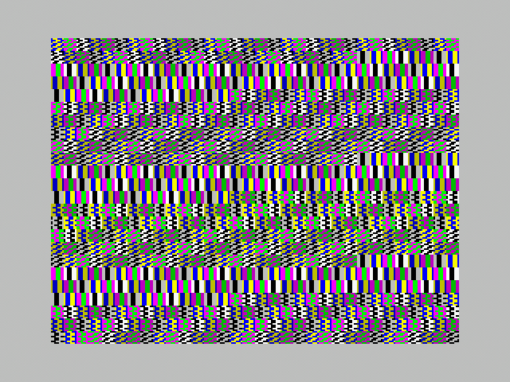

<h1 align="center">Channel 36</h1>

<p align="center"></p>
<p align="center">A 16 byte intro for the ZX Spectrum released at Lovebyte 2025.</p>

<p align="center">
• <a href="https://darkside.no/zx/darklite-channel_36.zip">Release</a>
• <a href="https://youtu.be/qU_quuPgPPk">Video</a>
• <a href="src/channel_36.asm">Source</a>
•</p>

## Introduction

This intro was conceived by tinkering in
[Bazematic](https://bazematic.demozoo.org/) to see what was I could do
in 8 bytes. In the end I expanded it to 16 to cycle through different
patterns to make it more interesting.

The intro displays different patterns on the screen by cycling through
a sequence of up to 18 8 bit values and writing these values to the
screen. The values are written to both the pixels and the
attributes. Every now and then a new sequence is selected.

## The code

The inner-most loop uses the `rla` and `ccf` instructions to cycle
through the values. `rla` rotates the accumulator left (via the carry
flag, basically a 9 bit rotate) and `ccf` inverts the carry flag.

There are 30 possible sequences, where all but two have a length of 18. 
```
000 100 101 103 107 10f 11f 13f 17f 1ff 0ff 0fe 0fc 0f8 0f0 0e0 0c0 080
001 102 105 10b 117 12f 15f 1bf 07f 1fe 0fd 0fa 0f4 0e8 0d0 0a0 040 180
002 104 109 113 127 14f 19f 03f 17e 1fd 0fb 0f6 0ec 0d8 0b0 060 1c0 081
003 106 10d 11b 137 16f 1df 0bf 07e 1fc 0f9 0f2 0e4 0c8 090 020 140 181
004 108 111 123 147 18f 01f 13e 17d 1fb 0f7 0ee 0dc 0b8 070 1e0 0c1 082
005 10a 115 12b 157 1af 05f 1be 07d 1fa 0f5 0ea 0d4 0a8 050 1a0 041 182
006 10c 119 133 167 1cf 09f 03e 17c 1f9 0f3 0e6 0cc 098 030 160 1c1 083
007 10e 11d 13b 177 1ef 0df 0be 07c 1f8 0f1 0e2 0c4 088 010 120 141 183
008 110 121 143 187 00f 11e 13d 17b 1f7 0ef 0de 0bc 078 1f0 0e1 0c2 084
009 112 125 14b 197 02f 15e 1bd 07b 1f6 0ed 0da 0b4 068 1d0 0a1 042 184
00a 114 129 153 1a7 04f 19e 03d 17a 1f5 0eb 0d6 0ac 058 1b0 061 1c2 085
00b 116 12d 15b 1b7 06f 1de 0bd 07a 1f4 0e9 0d2 0a4 048 190 021 142 185
00c 118 131 163 1c7 08f 01e 13c 179 1f3 0e7 0ce 09c 038 170 1e1 0c3 086
00d 11a 135 16b 1d7 0af 05e 1bc 079 1f2 0e5 0ca 094 028 150 1a1 043 186
00e 11c 139 173 1e7 0cf 09e 03c 178 1f1 0e3 0c6 08c 018 130 161 1c3 087
011 122 145 18b 017 12e 15d 1bb 077 1ee 0dd 0ba 074 1e8 0d1 0a2 044 188
012 124 149 193 027 14e 19d 03b 176 1ed 0db 0b6 06c 1d8 0b1 062 1c4 089
013 126 14d 19b 037 16e 1dd 0bb 076 1ec 0d9 0b2 064 1c8 091 022 144 189
014 128 151 1a3 047 18e 01d 13a 175 1eb 0d7 0ae 05c 1b8 071 1e2 0c5 08a
015 12a 155 1ab 057 1ae 05d 1ba 075 1ea 0d5 0aa 054 1a8 051 1a2 045 18a
016 12c 159 1b3 067 1ce 09d 03a 174 1e9 0d3 0a6 04c 198 031 162 1c5 08b
019 132 165 1cb 097 02e 15c 1b9 073 1e6 0cd 09a 034 168 1d1 0a3 046 18c
01a 134 169 1d3 0a7 04e 19c 039 172 1e5 0cb 096 02c 158 1b1 063 1c6 08d
01b 136 16d 1db 0b7 06e 1dc 0b9 072 1e4 0c9 092 024 148 191 023 146 18d
01c 138 171 1e3 0c7 08e
025 14a 195 02b 156 1ad 05b 1b6 06d 1da 0b5 06a 1d4 0a9 052 1a4 049 192
026 14c 199 033 166 1cd 09b 036 16c 1d9 0b3 066 1cc 099 032 164 1c9 093
029 152 1a5 04b 196 02d 15a 1b5 06b 1d6 0ad 05a 1b4 069 1d2 0a5 04a 194
02a 154 1a9 053 1a6 04d 19a 035 16a 1d5 0ab 056 1ac 059 1b2 065 1ca 095
055 1aa
```

Switching between sequences is done using the `daa` instruction and is
done after 65535 iterations (except for the first). 

With 256 possible starting values of the accumulator (the carry flag
is 0), there 256 different cycles of patterns. All of these end up
looping into one of these 3 loops:

```
003 003 009 007 007 026 026 026 00c 00e 026 00e 008 016 01c 007 005
016 019 019 019 01c
055
```

The longest loop was the most interesting and in the end 0x8c was
chosen as the starting value. 

To make this fit into 16 bytes, the low byte of the starting address
is used as the start value. The accumulator conveniently contains this
value at startup).

## Experimentation

Feel free to experiment with the code if you like. Remove the `ld c,
a` if you want a cleaner look, try a different starting address or
maybe change the `rla`/`scf` instructions.

