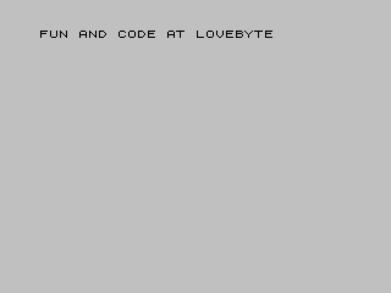

<h1 align="center">Lovebyte Partyscroller</h1>

<p align="center"></p>

<p align="center">A 64 byte intro for the ZX Spectrum released at Lovebyte 2025.</p>

<p align="center">
• <a href="https://darkside.no/zx/darklite-lovebyte_partyscroller.zip">Release</a>
• <a href="https://youtu.be/oB59p-jobuI">Video</a>
• <a href="src/scroller.asm">Source</a>
•</p>

## Introduction

This intro was the smallest of my Lovebyte intros where I knew what I
was going to make from the beginning. The target size was always 64
bytes.

The code is split into 3 parts. The first part prints the text to the
screen, the second moves this text to a buffer and the last part is
the scrolling.

## Printing the text

When the program starts, the screen is cleared and the scrolltext is
printed to the screen.

```diff
         ORG 0xf7c0
 start:
         call    0x0daf

         ld      de, text
 print_loop:
         ld      a, (de)
         rst     0x10
         inc     e
         jr      nz, print_loop
```

The program is loaded at address 0xf7c0. This address is not arbitrary
and the low and high byte of the address serve different purposes.

First the program clears the screen using the ROM function at
0xdef. This function will clear the screen with the current foreground
and background color, which usually is black on gray.

Then `de` is set to point to the text before the `print_loop` is
executed. This loops prints each character using the print character
function in the ROM. This function located at address 0x0010, so the
`rst 0x10` instruction can be used, which is the same as `call 0x0010`
but uses only 1 byte instead of 3.

The text is placed at the end of the program and since the start
address is 0xf7c0, the last character is located at address 0xf7ff. By
using `inc e` to increment the pointer, the zero flag will be set when
`e` is zero, and the loop will terminate after all characters have been
printed.

The text itself looks like this:

```diff
text:
         db      "FUN"
         db      0xc6
         db      0xaf
         db      0xac
         db      "LOVEBYTE"
```		 

If you watch the intro you will see that the scrolltext says "FUN AND
CODE AT LOVEBYTE", so what is going on here? 

If you've ever used a ZX Spectrum 48, you know that you don't type out
the BASIC keywords but instead press a single key for each
keyword. There are multiple keywords assigned to each key and the
keyword you get depends on context and modifier keys. The keywords are
printed on they keyboard, as seen in the image below.

<p align="center"></p>

The command to load from tape is `LOAD ""`, and to type this you press
`J` and then `""`. The way the ROM handles these keywords is that each
keyword has its own byte value. [This table](https://en.wikipedia.org/wiki/ZX_Spectrum_character_set#Character_set) 
at Wikipedia shows the entire ZX Spectrum character set where the
keywords are located from position 0xc5 to 0xff. `LOAD` is
0xef, so the BASIC bytecode for `LOAD ""` is 0xef,0x22,0x22. 

The keywords are only expanded when the bytecode is printed, for
example when typing or listing the BASIC program. This means that when
using ROM function for printing a character, these codes can be used
instead of the full words.

It took a while to figure out some reasonable text that used some of
these keywords. There were only 14 bytes available and I wanted the
text to mention Lovebyte. In the end I ended up with "FUN AND CODE AT
LOVEBYTE". The keywords used have the added bonus that they have the
right amount of spaces. "AND" is printed with space both before and
after, and "CODE" and "AT are printed with a space at the end.

Slowing down writing, you can see each character/keyword being
printed.

<p align="center"></p>

## Expanding the text

The next step is to convert the bitmap in the video memory to
something that is both easier to use as attributes and to scroll. The
video memory is a bitmap with 1 bit per pixel, and this is converted
to a 1 byte per pixel image in 256x8 byte buffer starting at address
0xf800.

```
         inc     d
 expand_loop_3:
         ld      l, e
 expand_loop_2:
         ld      b, 8
 expand_loop_1:
         sla     (hl)
         sbc     a
         ld      (de), a
         dec     e
         djnz    expand_loop_1
         inc     hl
         jr      nz, expand_loop_2
         inc     h
         inc     d
         jr      nz, expand_loop_3
```

There are 3 nested loops. The inner loop runs 8 times and processes
each bit in a byte, the middle loops runs 32 times, once for each byte
in a line and the outer loop runs 8 times, once for each line.

`hl` points to the start of the video memory, where the text is
located. `hl` is set to 0x4000 by the clear screen function in ROM so
there is no need to initialize this. `de` points to the buffer.

The printed text is located in the first 8 lines of the video
memory. The layout of the video memory is not linear, so the first
line is located at address 0x4000 to 0x401f, the second at 0x4100 to
0x411f and so until the 7th line at 0x4700 to 0x471f. The layout of
the rest can be ignored. 

### Breakdown

```
         inc     d
```

`de` is 0xf700 after the print code, so this will set `de` to 0xf800,
the start of the buffer.

```
 expand_loop_3:
         ld      l, e
```

This is the start of loop that is executed for each line and will
reset `l`, the low byte of the video pointer, to zero.

```
 expand_loop_2:
         ld      b, 8
```

This is the start of the loop that is executed once for each byte in
the video memory. `b` is the loop counter for the inner loop and is
initalized to 8.

```
 expand_loop_1:
         sla     (hl)
         sbc     a
         ld      (de), a
         dec     e
         djnz    expand_loop_1
```

This is the inner loop. It shifts the byte in video memory pointed to
by `hl` to the left and the top bit ends up in the carry flag. The
carry flag is then copied to all bits of `a` with the `sbc a`
instruction and the result is written to the buffer. If the pixel was
0, the byte will be 0x00, if it was 1 the byte will be 0xff.

The low byte of the buffer pointer is then decremented, so the bytes
in the buffer are written backwards.

This runs 8 times, converting the 8 pixels into 8 bytes in the buffer.

```
         inc     hl
         jr      nz, expand_loop_2
```

After the inner loop has finished, the video memory pointer is
increment to point to the next byte. Then the code jumps back to
`expand_loop_2` as long as the zero flag is not set. Neither `inc hl`
nor `djnz` modifies the zero flag, but `inc e` does, so this loop will
run as long as `e` is not zero. The inner loop runs 8 times, so this
will run 32 times, or the number of bytes in one line of video memory.

```
         inc     h
         inc     d
         jr      nz, expand_loop_3
```

In the end `h` and `d` are incremented to point to the next line in
video memory and the attribute buffer. The loops runs until `d`
wraps around to zero. It started at 0xf8, so this loop will run 8
times.

Note that since `sla (hl)` shifts the contents of the video memory,
this code will also clear the text.

A slowed down version of how this looks can be seen below. Note that
because of the `sra (hl)` instruction, the text on the screen
disappears.

<p align="center"></p>

This all happens in a couple of frames so the text is hardly visible.

The buffer at 0xf800 looks like this as a 256x8 image:

<p align="center"></p>

## Scrolling

The final piece of code is the scroller itself. This runs forever and
copies a 32x8 sliding window from the buffer to the attributes in the
middle of the screen.

```
         ld      d, 0x59
 main_loop:
         halt
         halt
         ld      h, 0xf8
 line_loop:
         ld      b, 32
         ld      l, c
 column_loop:
         ld      a, (hl)
         dec     l
         ld      (de), a
         inc     e
         djnz    column_loop
         inc     h
         jr      nz, line_loop
         dec     c
         jr      main_loop
```

`de` points to the attribute memory and `hl` to the 256x8 byte
buffer. `c` the start column in the buffer and is updated once per
frame.

### Breakdown

```
         ld      d, 0x59
```

`e` is already zero, so `de` is set to point to the middle of the
attribute memory by setting `d` is 0x59.

```
 main_loop:
         halt
         halt
         ld      h, 0xf8
```

This is the main loop and runs once for each frame. The `halt`
instruction waits for the next interrupt (which occurs at VSYNC), so
this makes sure the screen us updated at 25 hz.

The top byte of `hl` is set to point to 0xf8, the high address of the
256x8 buffer.

```
 line_loop:
         ld      b, 32
         ld      l, c
```

This is the start of the loop that runs once per line. `b` is set to
the number of columns on the screen and `l`, the pointer to the
buffer, is set to `c`. The value of `c` is the same for each line.

```
 column_loop:
         ld      a, (hl)
         dec     l
         ld      (de), a
         inc     e
         djnz    column_loop
```

The column loop iterates over 32 columns in the screen, copying bytes
from the buffer to the attribute memory. 0x00 will be black
and 0xff will be bright white. The blink bit will be set but the
foreground and background colors are the same so this will not be
visible.

The low byte of the buffer pointer is decremented (because the buffer
is backwards) and the low byte of the attribute memory pointer is
incremented. 

The loop runs 32 times, copying one line of attributes.

```
         inc     h
         jr      nz, line_loop
```

After one line is copied, the high byte of the buffer pointer is
incremented to point to the next line. The loop terminates when it
reaches zero. Remember that the buffer is located from 0xf800 to
0xff00, so this loop will run once for each line.

It is not necessary to update `de` since the attribute memory is
linear.

```
         dec     c
         jr      main_loop
```

In the end the index into the 256x8 buffer is decremented to shift the
text to the left and then it jumps back to the start of the main loop.

## Why is the buffer backwards?

There is no size difference between using the buffer backwards and
forwards and it can easily be changed by changing a couple of `dec`'s
to `inc`. However, I wanted to start with a blank screen and have the
text scroll in from the right. For this to work with a forwards
buffer, the start column in `c` must have a value between 192
and 224. By reversing the buffer the value now have to be between 32
and 64, or 0x20 to 0x40. Since `c` is 0x21 after calling the ROM clear
screen function, one or two bytes are saved.

## Why a buffer in the first place?

It turns out that using a buffer instead of reading pixels directly
from the video memory is about the same size. I did make a test
version without the buffer and ended up with 2 bytes larger size and
didn't look as good.

  
